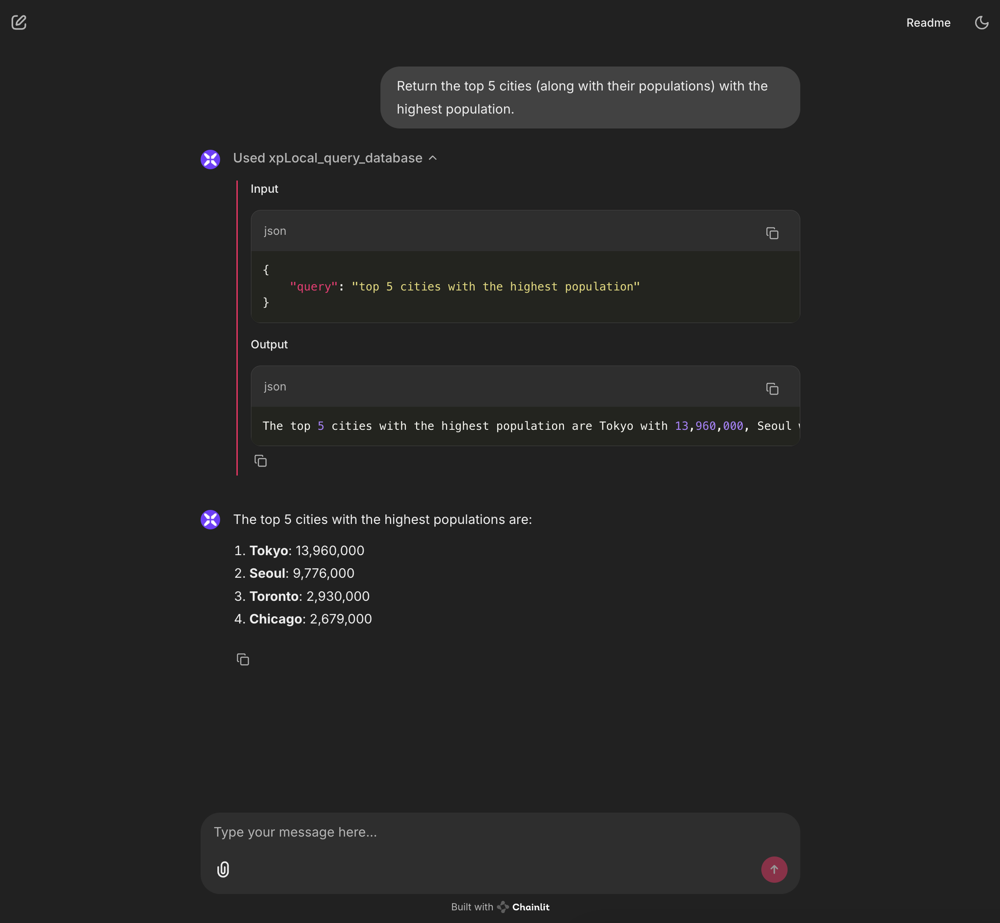

# City Statistics Query System
*An implementation example by xpander.ai*

## Overview

This example application, created by xpander.ai, demonstrates how to build a natural language interface for querying a SQL database using the xpander.ai agent orchestration platform. Users can ask questions about city statistics in plain language, and the system translates these queries to SQL, retrieves data, and provides human-readable responses.

This sample project serves as a starting point to illustrate core xpander.ai capabilities that you can leverage to build more sophisticated AI-powered applications.

### Demo Screenshot


*Interactive chat interface for querying city statistics data*

## Features

- Natural language querying of structured data
- SQL translation without writing SQL code
- Interactive chat interface
- Support for complex queries

## xpander.ai Capabilities

This sample demonstrates fundamental xpander.ai capabilities that you can extend for more complex applications:

### Agent Orchestration and State Management

xpander.ai handles multi-user scenarios and preserves conversation context. The implementation includes:

#### Multi-User Support

```python
# Initialize xpander instance per user
@cl.on_chat_start
def start_chat():
    xpander = ChainlitAdapter(agent_id=xpander_agent_id, api_key=xpander_api_key)
    cl.user_session.set("xpander", xpander)
```

- Each user session maintains its own state 
- State persists across page refreshes
- Concurrent users have isolated environments

#### Thread Management

```python
# Thread-specific conversation tracking
@cl.on_message
async def main(message: cl.Message):
    xpander: ChainlitAdapter = cl.user_session.get("xpander")
    thread_id: str = xpander.get_thread_id()
    xpander.add_task(message.content, thread_id=thread_id)
```

- Each conversation has a distinct thread ID
- Messages are preserved per user and thread
- Conversation context maintains continuity

#### Message Persistence

```python
# Message storage and retrieval
xpander.agent.add_messages(messages=[{
    "role": "assistant", 
    "content": msg.content
}])
```

- Messages contain role, content, and context information
- Messages are automatically preserved across sessions
- Conversation history is maintained per thread

#### Task Management

```python
# Task handling with context
xpander.add_task(message.content, thread_id=thread_id)
xpander.process_tool_calls(tool_calls=tool_calls, local_tools=local_tools_by_name)
```

- Each task maintains its own execution state
- Related tasks share conversation context
- Tool execution state is preserved within tasks

### Real-time Streaming

```python
# Token-by-token streaming
stream = await run_completion()
async for part in stream:
    if token := part.choices[0].delta.content or "":
        await msg.stream_token(token)
```

- Token-by-token streaming of AI responses
- Non-blocking operations for UI responsiveness
- Optimized response handling

### API Integration

```python
# API configuration
xpander_api_key = os.environ.get("XPANDER_API_KEY","") 
xpander_agent_id = os.environ.get("XPANDER_AGENT_ID", "") 
```

- Secure API authentication
- Support for self-hosted deployment
- Fine-grained access control

### Tool Management

```python
# Tool registration and execution
xpander.agent.add_local_tools(local_tools_list)
xpander.process_tool_calls(tool_calls=tool_calls, local_tools=local_tools_by_name)
```

- Dynamic registration of custom tools
- Efficient handling of multiple tool calls
- Organized processing of task requests

## Extending This Example

This starter example demonstrates the foundational capabilities of xpander.ai. From here, you can build more complex applications such as:

- Multi-database queries across different data sources
- Custom tool integration for specialized domain operations
- Enterprise-scale deployments with high concurrency
- Integration with business logic and existing systems
- Fine-tuned AI models for specialized domains

The core patterns demonstrated in this sample (state management, thread handling, tool execution) can be extended to support much more sophisticated agent-based applications.

## Technology Stack

- **Frontend**: [Chainlit](https://github.com/Chainlit/chainlit) - Chat interface
- **Backend**:
  - [LlamaIndex](https://www.llamaindex.ai/) - Natural language to SQL translation
  - [xpander.ai](https://xpander.ai/) - Agent orchestration
- **Language Models**: OpenAI GPT models
- **Database**: SQLite with SQLAlchemy

## Setup Instructions

### Prerequisites

- Python 3.8+
- OpenAI API key
- xpander.ai API key and agent ID

### Installation

1. Clone the repository

```bash
git clone <repository-url>
cd city-statistics-query-system
```

2. Create a virtual environment and activate it

```bash
python -m venv .venv
source .venv/bin/activate  # On Windows: .venv\Scripts\activate
```

3. Install dependencies

```bash
pip install -r requirements.txt
```

4. Create a `.env` file in the root directory:

```bash
XPANDER_API_KEY="your-xpander-api-key"
XPANDER_AGENT_ID="your-xpander-agent-id"
OPENAI_API_KEY="your-openai-api-key"
```

### Running the Application

Start the application:

```bash
chainlit run app.py
```

The application will be available at `http://localhost:8000`.

## Usage

1. Open your browser to `http://localhost:8000`
2. Type natural language queries about city statistics
3. The system translates your query to SQL and returns results

### Example Queries

- "What is the population of Tokyo?"
- "Which city has the highest population?"
- "List all cities in Canada"
- "Compare the populations of Chicago and Seoul"

## Data Structure

The system stores the following cities and their statistics:

| City    | Population | Country       |
| ------- | ---------- | ------------- |
| Toronto | 2,930,000  | Canada        |
| Tokyo   | 13,960,000 | Japan         |
| Chicago | 2,679,000  | United States |
| Seoul   | 9,776,000  | South Korea   |

## Project Structure

- `app.py`: Main application with Chainlit, LlamaIndex, and xpander.ai integration
- `db.py`: Database setup and initialization
- `requirements.txt`: Project dependencies
- `.env`: Environment variables

## Acknowledgments

- [Chainlit](https://github.com/Chainlit/chainlit) for the chat interface
- [LlamaIndex](https://www.llamaindex.ai/) for the data framework
- Published by [xpander.ai](https://xpander.ai/) as a sample implementation of the agent orchestration platform