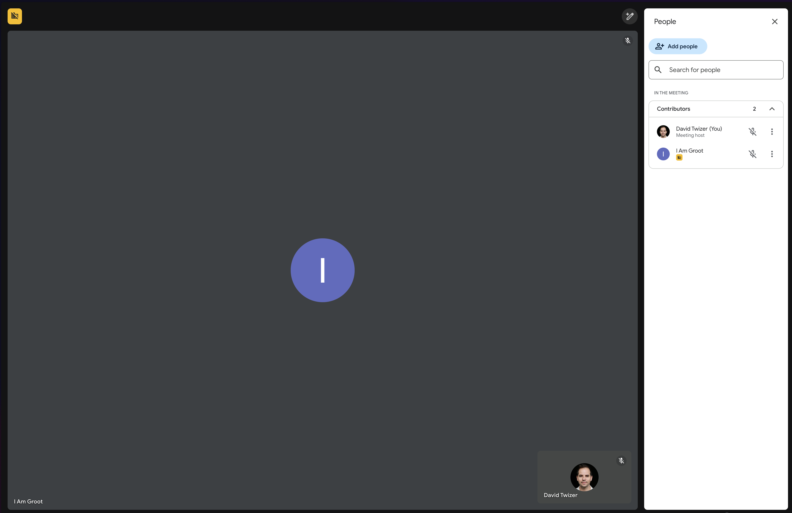
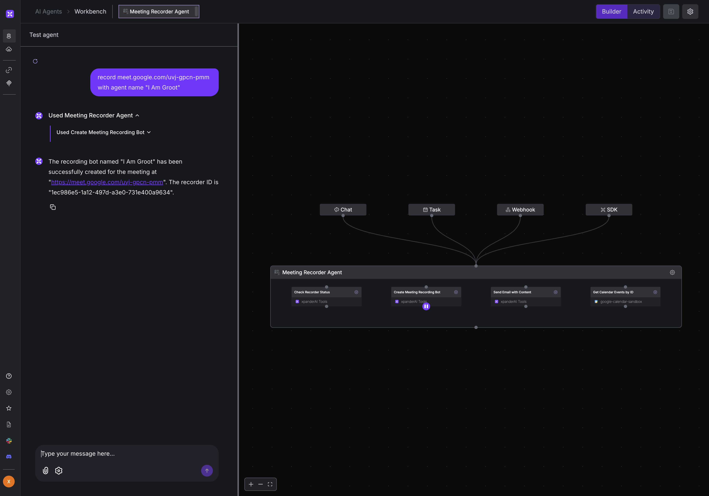
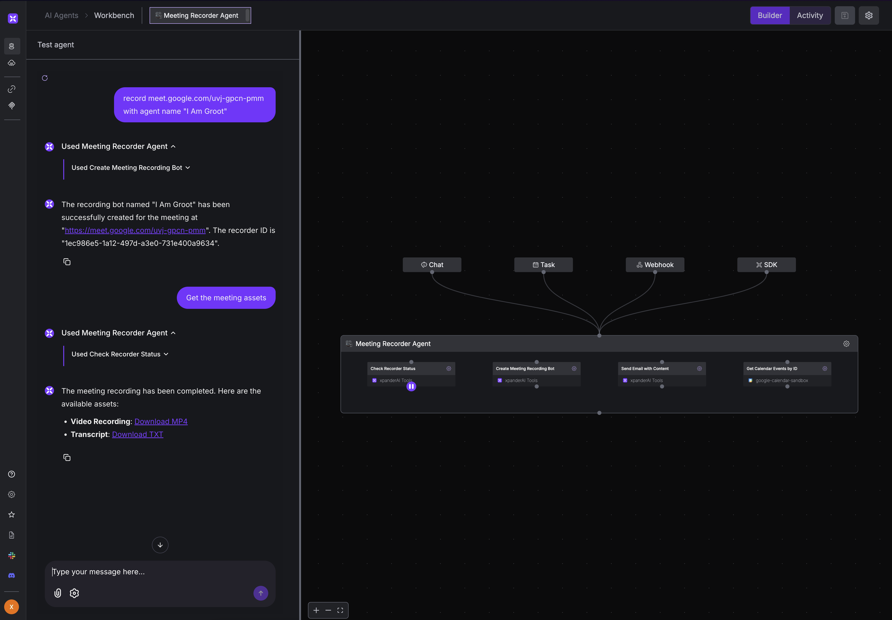

<div align="center">

# Meeting Recorder Agent


[](https://opensource.org/licenses/MIT)
[](http://makeapullrequest.com)

**A simple AI agent that records Google Meet meetings and tracks them automatically.**  
Built with [xpander.ai](https://xpander.ai)

[Key Features](#-key-features) • [Quick Start](#-quick-start) • [How It Works](#-how-it-works) • [Usage](#-usage) • [Monitoring](#-monitoring)

</div>

## 🌟 Key Features

- ✅ **Automated Recording** - Records Google Meet meetings without manual intervention
- 📊 **Meeting Management** - Keeps track of all your recorded meetings in one place
- 📝 **Content Generation** - Creates transcripts and downloadable video files
- 📅 **Calendar Integration** - Shows your calendar events with meeting statuses

## 🚀 Quick Start

### Prerequisites

- Python 3.8+
- Google Meet account
- [Xpander.ai](https://xpander.ai) account

### Installation

```bash
# Clone and set up
git clone https://github.com/xpander-ai/meeting-recorder-agent.git
cd meeting-recorder-agent

# Create virtual environment
python -m venv .venv
source .venv/bin/activate  # On Windows: .venv\Scripts\activate

# Install dependencies
pip install -r requirements.txt
```

### Setting Up Your Agent

You have two options to set up the agent on Xpander.ai:

#### Option 1: Use the Template (Recommended)

1. Log in to your [Xpander.ai](https://xpander.ai) account
2. Go to the [Meeting Recorder Template](https://canvas.xpander.ai/template/meeting-recorder)
3. Click "Import Template" to add it to your workspace
4. Once imported, navigate to your agent's settings
5. Copy your **Agent ID** and **API Key** from the canvas

#### Option 2: Manual Setup

If you prefer to build the agent manually:

1. Log in to your [Xpander.ai](https://xpander.ai) account
2. Click "Create New Agent" from your dashboard
3. Add the following tools to your agent:
   - **Check Recorder Status** tool
   - **Create Meeting Recording Bot** tool
   - **Send Email with Content** tool
   - **Get Calendar Events by ID** tool
4. Configure each tool with appropriate settings
5. Save your agent and copy your **Agent ID** and **API Key** from the agent settings page

### DEMO (Using the xpander Agent Workbench UI)

<div align="center">
  
  <p><em>Ask the agent to record a new meeting by providing the Google Meet URL</em></p>
  
  
  <p><em>Approve the recording bot to join your Google Meet session</em></p>
  
  
  <p><em>Ask the agent to retrieve the meeting transcript and video recording</em></p>
</div>

<div align="center">
  
  <p><em>Meeting Recorder Agent with all tools configured and ready to use</em></p>
</div>

### Configuration

1. Copy the example environment file:

```bash
cp .env.example .env
```

2. Edit `.env` with your API keys:

```
OPENAI_API_KEY=your_openai_key
XPANDER_API_KEY=your_xpander_key
XPANDER_AGENT_ID=your_agent_id
```

## 📚 How It Works

The agent uses three main components:

1. **Main App (`app.py`)**: Coordinates everything and schedules checks
2. **Meeting Agent (`meeting_agent.py`)**: Connects to Xpander.ai to run the agent
3. **Recordings Manager (`recordings.py`)**: Tracks meetings in `recording_ids.json`

### Agent Tools

<table>
<tr>
  <td width="25%" align="center">
    <h4>🔎<br>Check Recorder Status</h4>
  </td>
  <td>
    Queries the status of recording bots and retrieves information about recordings:
    <ul>
      <li>Shows if recordings are in progress or completed</li>
      <li>Provides links to video, audio, and transcript downloads</li>
      <li>Displays metadata like duration and participants</li>
    </ul>
  </td>
</tr>
<tr>
  <td width="25%" align="center">
    <h4>🤖<br>Create Recording Bot</h4>
  </td>
  <td>
    Creates and deploys a new bot to record a Google Meet session:
    <ul>
      <li>Accepts Google Meet URLs in any format</li>
      <li>Automatically joins meetings using specified credentials</li>
      <li>Creates a dedicated recorder ID for tracking</li>
    </ul>
  </td>
</tr>
<tr>
  <td width="25%" align="center">
    <h4>📧<br>Send Email Content</h4>
  </td>
  <td>
    Sends meeting summaries and recordings via email:
    <ul>
      <li>Sends transcript summaries to meeting participants</li>
      <li>Attaches or links to recording files</li>
      <li>Supports customized email templates</li>
    </ul>
  </td>
</tr>
<tr>
  <td width="25%" align="center">
    <h4>📅<br>Get Calendar Events</h4>
  </td>
  <td>
    Connects with your Google Calendar:
    <ul>
      <li>Fetches upcoming and past calendar events</li>
      <li>Links calendar events to meeting recordings</li>
      <li>Provides scheduling information for the agent</li>
    </ul>
  </td>
</tr>
</table>

## 🔍 Usage

Check all your recorded meetings:

```bash
python app.py
```

Record a specific meeting:

```bash
python app.py "please record meet.google.com/abc-defg-hij"
```

Check your calendar:

```bash
python app.py "what's on my calendar"
```

## 💾 Data Structure

The agent stores meeting information in `recording_ids.json`:

```json
{
  "67593763-9093-4fd4-88df-98c8bc75600a": {
    "url": "https://meet.google.com/dnj-wduu-goa"
  },
  "f4f81ac7-c28a-4831-8cfc-fa56e3c2b29c": {
    "url": "https://meet.google.com/gcd-zuba-qar"
  }
}
```

## 📊 Example Output

When you run the agent asking about calendar events:

```bash
python app.py "what's on my calendar"
```

It responds with:

```
Here are the events on your calendar and the status of the recording bots:

### Calendar Events:
1. **Onboarding to Xpander**
   - Date & Time: April 9, 2025, 17:31 - 18:31 UTC
   - [Event Link](https://www.google.com/calendar/event?eid=...)

2. **Meeting with David about xpander**
   - Date & Time: April 9, 2025, 20:27 - 21:27 UTC
   - [Event Link](https://www.google.com/calendar/event?eid=...)

### Recording Bots Status:
1. **Recorder ID: 67593763-9093-4fd4-88df-98c8bc75600a**
   - Status: Done
   - Meeting URL: [meet.google.com/dnj-wduu-goa](https://meet.google.com/dnj-wduu-goa)
   - Video: [Download MP4](https://links.xpander.ai/jz0zr6w)
   - Transcript: [Download TXT](https://links.xpander.ai/kb42drv)
```

## 🔍 Monitoring

You can use the xpander.ai platform to monitor the logs of the agent:


## 👨‍💻 Built With Xpander.ai

[Xpander.ai](https://xpander.ai) is an AI Agent platform that lets developers build, test, and deploy AI agents quickly. It provides:

- **State Management**: Handles complex agent states so you don't have to
- **Provider Independence**: Works with OpenAI, Anthropic, Gemini, and more
- **Tool Integration**: Easy calendar, meeting, and custom tool integration

## 📝 License

This project is licensed under the MIT License - see the [LICENSE](LICENSE) file for details.

## 🤝 Contributing

Contributions are welcome! Please feel free to submit a Pull Request.

## 📧 Contact

Questions? Reach out to us at [support@xpander.ai](mailto:support@xpander.ai)
