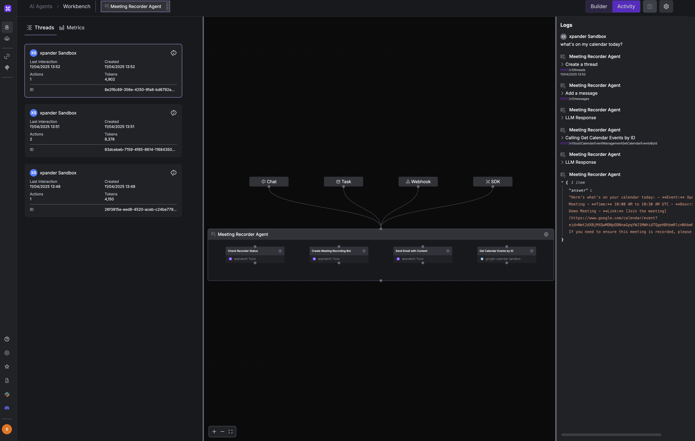

<div align="center">
  <h1>Meeting Recorder Agent</h1>

  
  

  <p>
    A simple AI agent that records Google Meet meetings and tracks them automatically.<br>
    Built with <a href="https://xpander.ai">xpander.ai</a>
  </p>
</div>

## What It Does

- Records Google Meet meetings automatically
- Keeps track of all your recorded meetings
- Generates transcripts and downloadable videos
- Shows your calendar events and meeting statuses

## Quick Start

### 1. Install

```bash
# Clone and set up
git clone https://github.com/yourusername/meeting-recorder-agent.git
cd meeting-recorder-agent

# Create virtual environment
python -m venv .venv
source .venv/bin/activate  # On Windows: .venv\Scripts\activate

# Install dependencies
pip install xpander-sdk python-dotenv openai
```

### 2. Load Agent Template

1. Log in to your [Xpander.ai](https://xpander.ai) account
2. Navigate to the Agents dashboard
3. Click "Create New Agent" or "Import"
4. Select "Meeting Recorder Agent" template
5. Click "Create" to add it to your workspace

The template includes four independent tools that can be used individually or together:

- **Check Recorder Status**: Queries the status of recording bots and retrieves information about recordings
  - Shows if recordings are in progress or completed
  - Provides links to video, audio, and transcript downloads
  - Displays metadata like duration and participants

- **Create Meeting Recording Bot**: Creates and deploys a new bot to record a Google Meet session
  - Accepts Google Meet URLs in any format
  - Automatically joins meetings using specified credentials
  - Creates a dedicated recorder ID for tracking

- **Send Email with Content**: Sends meeting summaries and recordings via email
  - Sends transcript summaries to meeting participants
  - Attaches or links to recording files
  - Supports customized email templates

- **Get Calendar Events by ID**: Connects with your Google Calendar
  - Fetches upcoming and past calendar events
  - Links calendar events to meeting recordings
  - Provides scheduling information for the agent

These tools are modular and have no dependencies between them, making it easy to customize or extend the agent's functionality for your specific needs.

### 3. Configure

Create a `.env` file with your API keys:

```bash
OPENAI_API_KEY=your_openai_key
XPANDER_API_KEY=your_xpander_key
XPANDER_AGENT_ID=your_agent_id
```

### 4. Use

Check all your recorded meetings:

```bash
python app.py
```

Record a specific meeting:

```bash
python app.py "please record meet.google.com/abc-defg-hij"
```

Check your calendar:

```bash
python app.py "what's on my calendar"
```

## How It Works

The agent uses three main components:

1. **Main App (`app.py`)**: Coordinates everything and schedules checks
2. **Meeting Agent (`meeting_agent.py`)**: Connects to Xpander.ai to run the agent
3. **Recordings Manager (`recordings.py`)**: Tracks meetings in `recording_ids.json`

### Recording IDs Explained

The agent stores meeting information in `recording_ids.json`:

```json
{
  "67593763-9093-4fd4-88df-98c8bc75600a": {
    "url": "https://meet.google.com/dnj-wduu-goa"
  },
  "f4f81ac7-c28a-4831-8cfc-fa56e3c2b29c": {
    "url": "https://meet.google.com/gcd-zuba-qar"
  }
}
```

Each entry contains:

- A unique recording bot ID (generated by Xpander.ai)
- The meeting URL

## Sample Output

When you run the agent asking about calendar events:

```bash
python app.py "what's on my calendar"
```

It responds with:

```md
Here are the events on your calendar and the status of the recording bots:

### Calendar Events:
1. **Onboarding to Xpander**
   - Date & Time: April 9, 2025, 17:31 - 18:31 UTC
   - [Event Link](https://www.google.com/calendar/event?eid=...)

2. **Meeting with David about xpander**
   - Date & Time: April 9, 2025, 20:27 - 21:27 UTC
   - [Event Link](https://www.google.com/calendar/event?eid=...)

### Recording Bots Status:
1. **Recorder ID: 67593763-9093-4fd4-88df-98c8bc75600a**
   - Status: Done
   - Meeting URL: [meet.google.com/dnj-wduu-goa](https://meet.google.com/dnj-wduu-goa)
   - Video: [Download MP4](https://links.xpander.ai/jz0zr6w)
   - Transcript: [Download TXT](https://links.xpander.ai/kb42drv)
```

## Monitoring

You can use the xpander.ai platform to monitor the logs of the agent



## Built With Xpander.ai

[Xpander.ai](https://xpander.ai) is an AI Agent platform that lets developers build, test, and deploy AI agents quickly. It provides:

- **State Management**: Handles complex agent states so you don't have to
- **Provider Independence**: Works with OpenAI, Anthropic, Gemini, and more
- **Tool Integration**: Easy calendar, meeting, and custom tool integration

The platform manages all the complex infrastructure while you focus on what your agent does.
